<<<<<<< HEAD
# User Manual
=======
# User Manual

## What this app is for 
This is an app made for uni students to allow them to keep track of where their friends are and to place pins alerting them of dangers and information. A pin is a marker that can be placed on the map to highlight a safety-related  incident or hazard at a specific location, such as a road closure or a suspicious incident. Pins are created by users and are visible to everyone using the app.

## Getting started 
To get started, open the app and you will be taken to the Select User screen. Select your user from the list to access the app. Once selected, you will be taken to the Map screen where you can begin using the app.

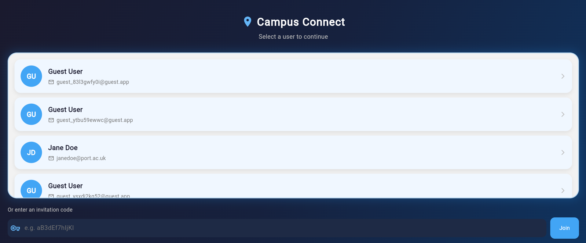

## Main screens in this app 
There are 3 main screens in this app
### Select User Screen
This screen allows you to select a user, if this app were to exist as a real application, this would be a login screen with proper usernames, passwords and authentication
### Map Screen
This screen contains 4 buttons, one to filter pins, one to toggle whether you want to share your location with the website, one to centre your location and one to add a pin. A picture shows where each of these 4 buttons are located 

The filter button opens a menu that lets you control which pins are visible 
on the map based on category, category level and expiry date. The location 
sharing toggle turns your live location sharing on or off for the friends you 
have enabled it for in your friends list. The centre location button moves the 
map back to your current position if you have scrolled away from it. The add 
pin button starts the pin creation process, which is explained in more detail 
further on in this guide.
### Profile Screen
This screen allows you to view your profile, see how many pins you've made, edit your name and display name and view your friend codes

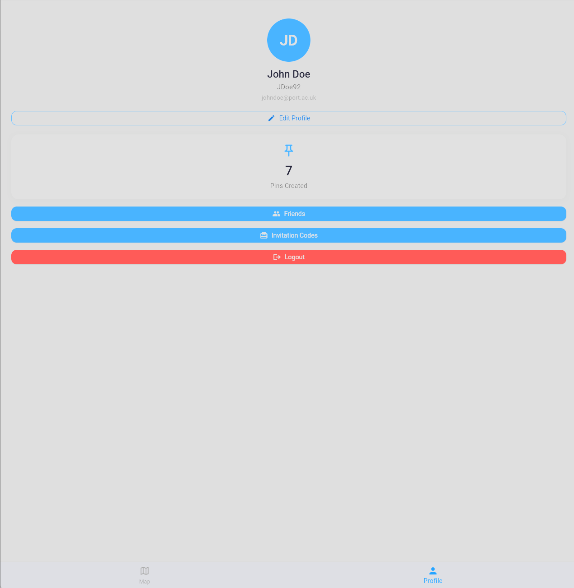

Details on what each of these buttons do will be explained further on in the document 

## Navigating the map

Once on the map screen you can interact with the map in the following ways:

**Zoom in and out** - use a pinch gesture with two fingers to zoom in and out on the map, or use the scroll wheel if you are using the app in a browser

**Pan around** - tap and drag the map in any direction to explore different areas

**Centre your location** - if you have scrolled away from your current position, press the centre location button to snap the map back to where you are. This button is shown in the map screen section of this guide
**Tap a pin** - tap on any pin on the map to open its details at the bottom of the screen

**Tap a cluster** - if multiple pins are grouped together into a dark blue cluster, tap it to see a list of the individual pins inside it

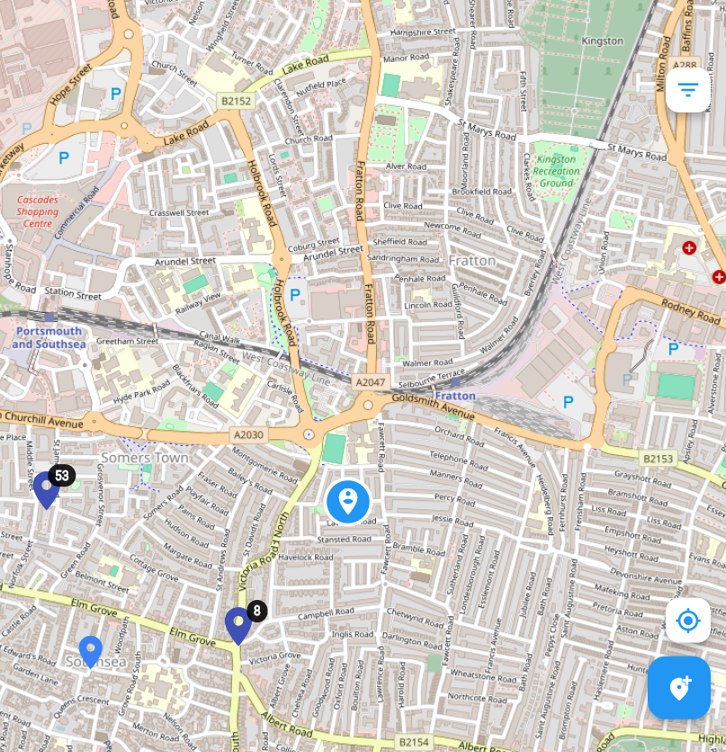

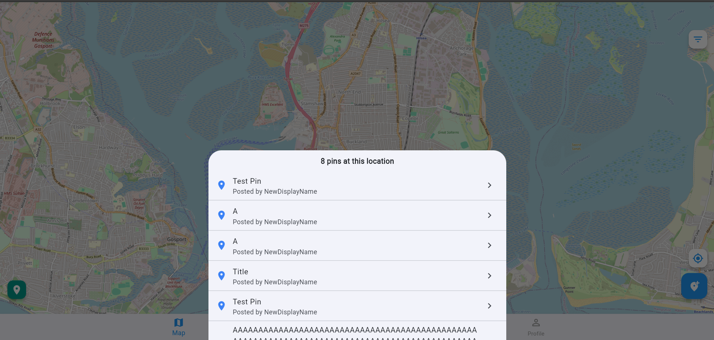

## Creating a pin 

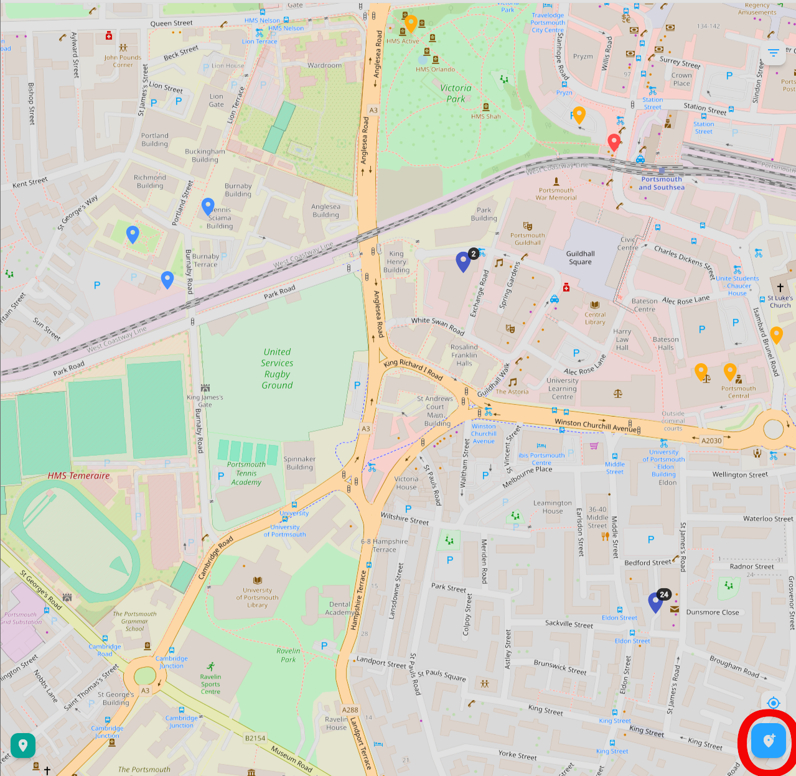

In order to create a pin, you need to press the button circled in the picture above. Once you do that, you will be prompted to click on where you want the pin to be placed. If you have location enabled, it will default to placing the pin at your current location however you may still move it if the incident occurred in a different location to where you are. A picture of how this looks is below 

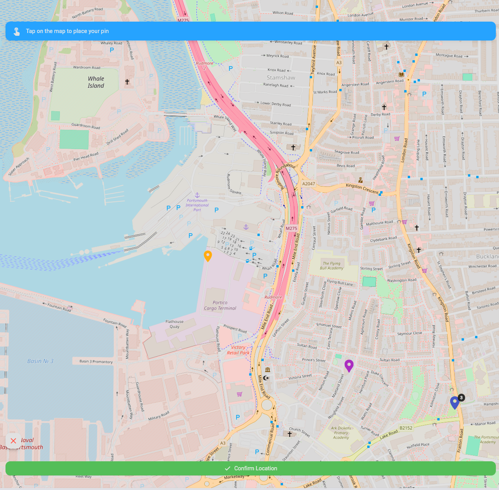

Once you confirm the location you want the pin to be placed in, you will be shown the menu seen in the picture below

By clicking on the categories, you will get the drop down shown in the picture below

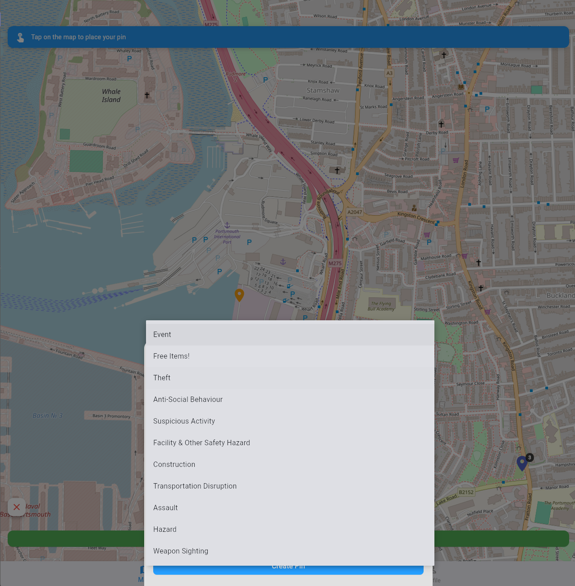

Once you click on one of these, the menu will look as it does below

From here, you can choose an optional subcategory if you want to give more information for easier identification of what the pin is about, give the pin a title which is required to create a pin and explains to a user when clicking on the pin what it is about and an optional description for if you want to go into more detail about the event that the pin correlates to.The title has a limit of 30 characters and the description has a limit of 300 characters. A counter in the bottom right of each field shows how many characters you have used so far out of the maximum allowed. Once you do this, the form will show you how long the pin will remain on the map before it expires. By default pins expire in 24 hours.

## Viewing and filtering pins 
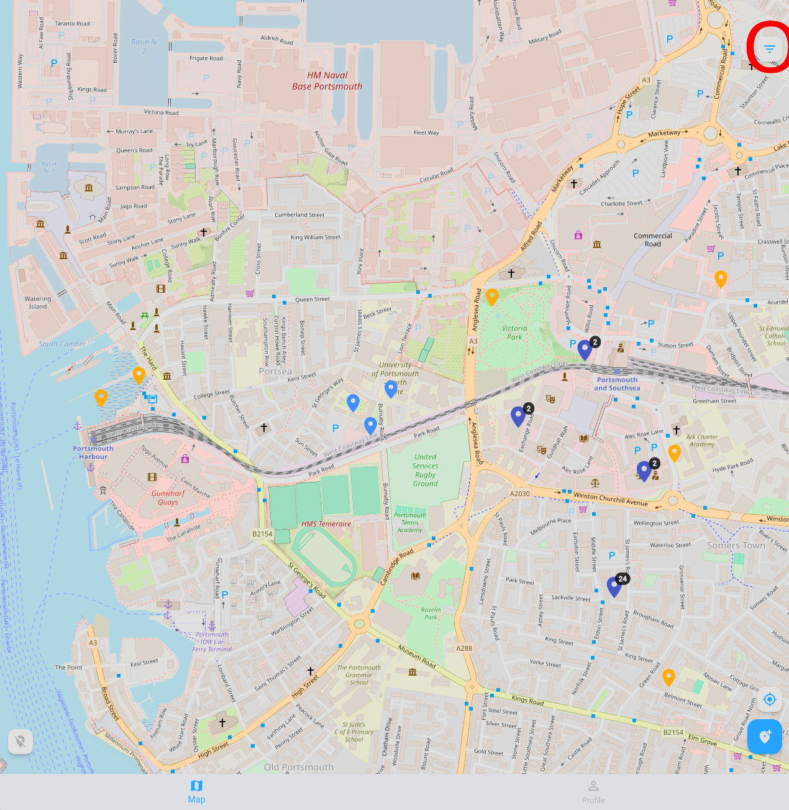

When you click on the button shown above, you will see a menu pop up, shown below

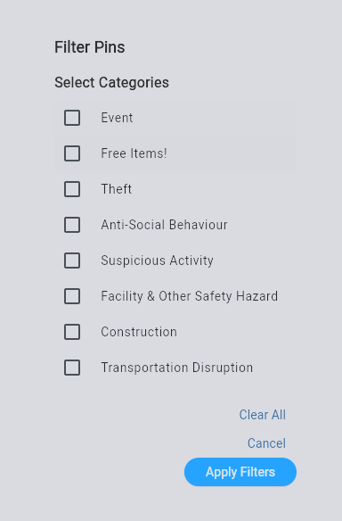

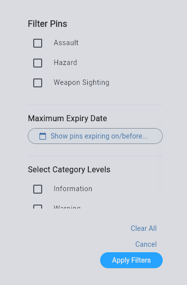

As you can see from the 2 pictures above, you can filter the pins that are visible by category, expiry date (Maximum expiry date refers to pins that expire before or on the specified date) or also by the category level (what kind of category it is, e.g. Free Items! comes under information)
Once you have selected the filters you want, press apply filters and then all the pins that come under one or more of the filters you have selected will appear. To clear your filters and return to viewing all pins, open the filter menu again and deselect any active filters before pressing apply
filters.
## Pin interaction
When looking at pins on a map, there are 3 types of pins, each signified by a different colour. Red pins signify the danger category level, yellow pins signify the warning category level and light blue pins represent information. When clicking on any of these types of pins, a menu will appear from the bottom as shown below

As you can see in the picture above, there is a title, then under it is the category and subcategory of the pin, then any further description regarding what the pin is about. 
If there are multiple pins close enough to be touching on the map, then the program will aggregate them into a dark blue pin with a number signifying how many pins are present at that location. When that type of pin is clicked, a menu will appear like the one below

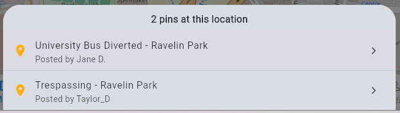

If you click on any of the items listed in this menu, then it will behave akin to clicking on a single pin of another type

### Pin Reporting
If you are logged in, you will also see a button with three dots in the top 
right corner of the pin detail panel. Tapping this will give you the option 
to report the pin. Tapping report will show three options:

- **Inaccurate** - the information on the pin is no longer correct
- **Resolved** - the incident has been resolved
- **Duplicate** - the pin already exists elsewhere on the map

Select the option that best describes the issue and the report will be sent. 
You can only report a pin once. If you are not logged in, the three dot menu 
will not appear.

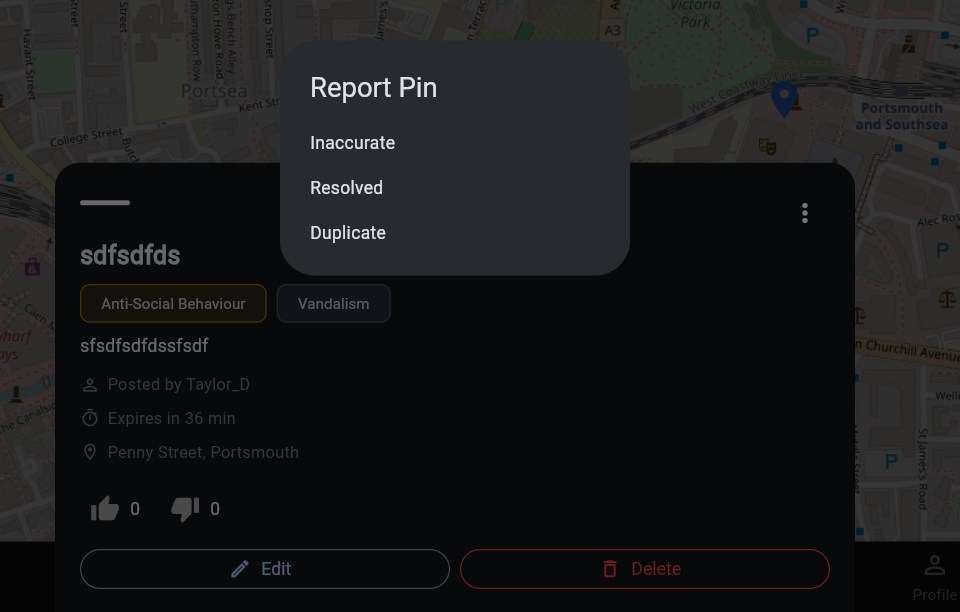

## Friends, sending friend requests and Location sharing
If you navigate to the profile section of the app, you will notice that there is a button that says Friends. In this section, you can see your friends list, see your incoming and outgoing friend requests and add new friends. In this app, adding friends allows you to share your location with them if you so choose

### Location sharing

Location sharing allows your friends to see where you are on the map in real 
time. To enable location sharing with a friend, navigate to the friends list 
on the profile screen. Next to each friend in your list there is a toggle 
switch, switching this on means that friend will be able to see your location 
on the map. To stop sharing your location with a friend, simply toggle the 
switch back off and your pin will no longer be visible to them.

You can also toggle all location sharing on and off directly from the map 
screen using the location sharing button shown in the map screen section of 
this guide. Turning this off will stop sharing your location with all friends 
at once regardless of the individual toggles set in your friends list.

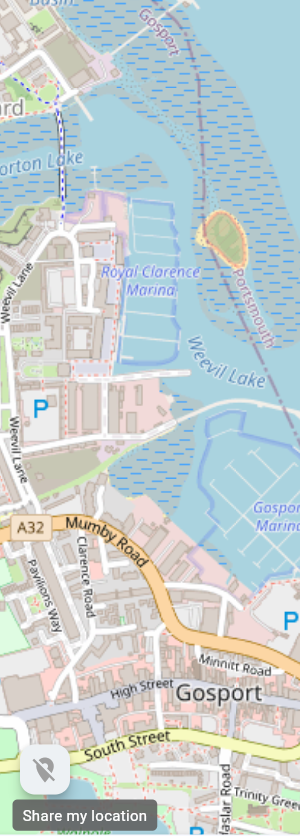  

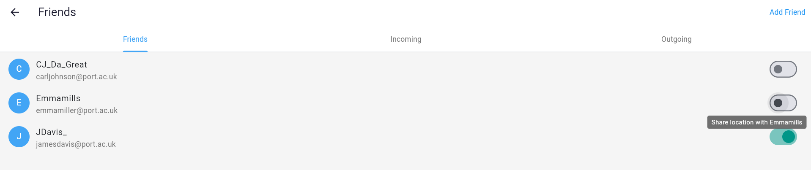

### Incoming friend requests

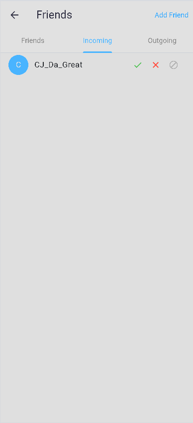

In the picture above, you can see the incoming section. In this section, you can see all of your incoming friend requests, if any. If you want to accept a friend request, press the tick button, if you want to decline a friend request, press the cross button and if you want to block the user, press the block button (the final one)

### Outgoing friend requests 

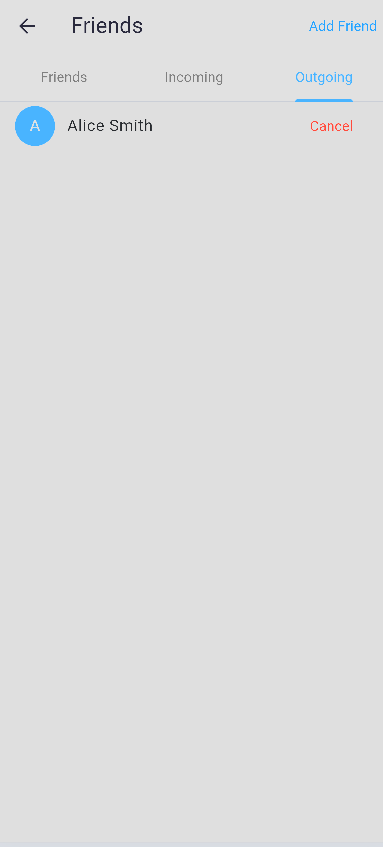

In the picture above, you can see the outgoing friend requests of a user, if you want to cancel a friend request for whatever reason, you can press the cancel button and the friend request will disappear from the other user's incoming friend requests 

### Adding a friend

By tapping on the button that says Add Friend, you will open up the screen seen below

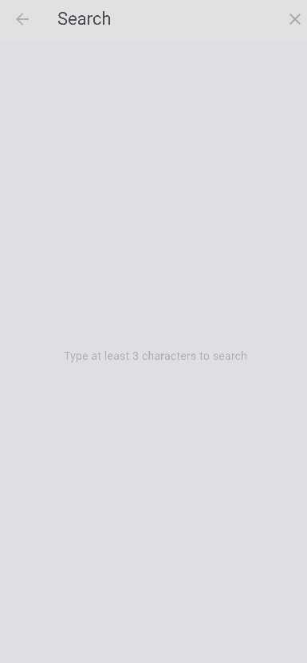

In this screen, you can search for a user either by typing at least 3 consecutive letters of their name or by typing their university email address. Searching by email is more reliable if you are unsure of their display name. The search feature will show suggestions based on what you have typed so far, an example of this is below.

By then clicking Add Friend, a friend request will be sent to the given user unless you are already friends with them in which case it will say "You are already friends". The user you sent the request to will see it appear in their Incoming tab, 
where they can choose to accept or decline it.

### Invitation codes
On the profile screen, you can view your invitation code. You can share this code with another user so that they can add you as a friend directly using the code instead of searching by name.Thes invitation codes last for 24 hours.

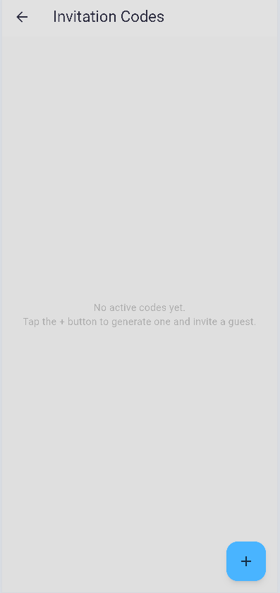

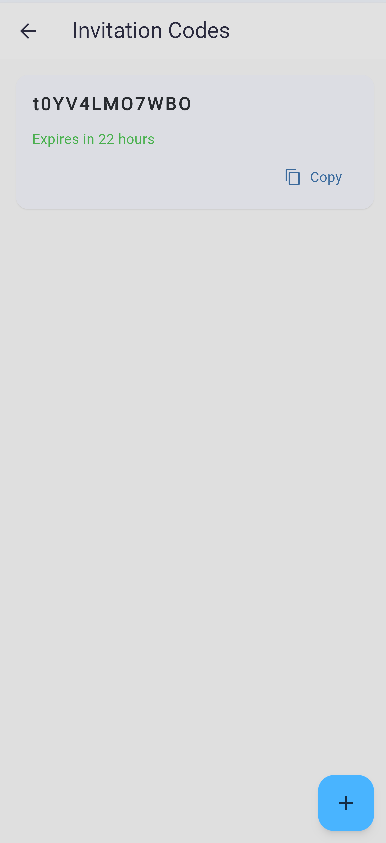

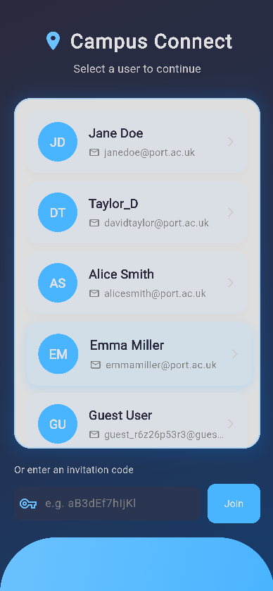

## Editing your profile

To edit your name or display name, navigate to the profile screen and click on "Edit Profile" . You will see your current name and display name displayed on the screen. Tap on the edit button next to the field you want to change, type in your new name and then press save to confirm the change. You can also edit the name you want displayed , as well as if you want your Full Name or Display Name to be shown under the pin.

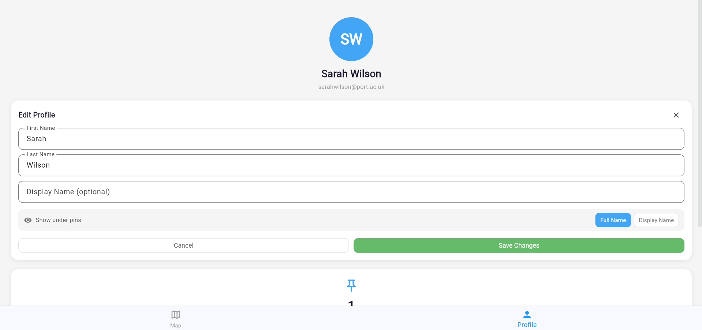

## Common messages

**You are already friends** - This appears in the add friend screen when you 
try to send a friend request to a user you are already friends with.

**Friend request already sent** - This appears if you try to send a friend 
request to someone you have already sent one to but they have not yet accepted 
or declined it.

**Please select a category** - This appears on the create pin screen in red 
below the category field when you try to create a pin without selecting a 
category. To fix this, tap the category dropdown and select a category before 
pressing Create Pin.

**Please enter a title** - This appears on the create pin screen in red below 
the title field when you try to create a pin without entering a title. To fix 
this, type a title into the title field before pressing Create Pin.

**No users found** - This appears on the add friend screen when the name you 
have searched for does not match any registered users. Check that you have 
spelled the name correctly and that you have typed at least 3 consecutive 
letters.

## Frequently Asked Questions (FAQ's)

**Why can I see the map but not create a pin?**

You need to be logged in to create a pin. If you are on the Select User 
screen, select your user first and then you will be able to use the add pin 
button on the map screen.

**Why is my pin not appearing on the map after I created it?**

Make sure you have filled in all the required fields when creating a pin. The 
title and category are both required, without these the pin will not be 
created. If you have filled these in and the pin is still not appearing, try 
refreshing the map by navigating away and back to the map screen.

**Why can I not see my friend on the map?**

There are two reasons this might happen. First, check that you and your friend 
are both on each other's friends list and that the friend request has been 
accepted. Second, check that you have toggled location sharing on for that 
friend in your friends list, as the toggle needs to be enabled for their 
location to appear on the map.

**Why is my friend request not showing up for the other user?**

Make sure you have searched for at least 3 consecutive letters of their name 
and selected the correct user from the suggestions before pressing Add Friend. 
The other user will see the request in their Incoming tab on the friends screen.

**How do I stop my location being shared?**

You can either toggle off the individual friend switches in your friends list, 
or use the location sharing button on the map screen to stop sharing with all 
friends at once.

**Why are some pins not visible on the map?**

You may have filters applied. Open the filter menu and deselect any active 
filters then press apply filters to return to viewing all pins.

**What do the different pin colours mean?**

Red pins are danger level, yellow pins are warning level and light blue pins 
are information level. These correspond to the category level of the incident 
that was reported.

**What happens if I accidentally send a friend request to the wrong person?**

Navigate to the Outgoing tab in the friends section of your profile and press 
the cancel button next to the request to withdraw it before the other user 
accepts it.

>>>>>>> 01eab28c291eb67fe118b46b7f542186640f7742
