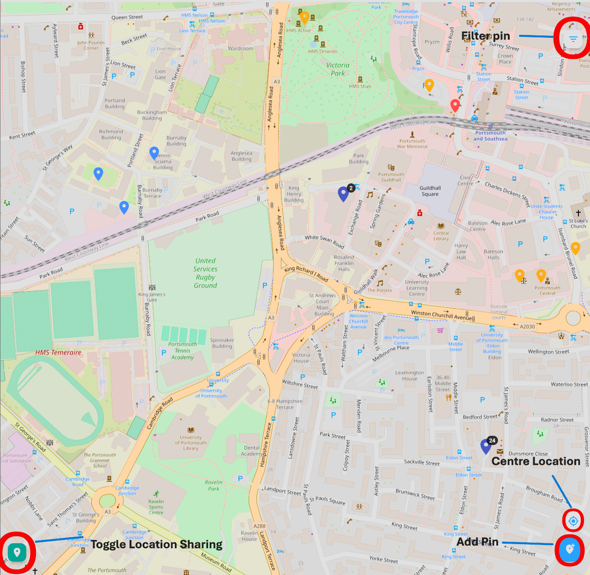
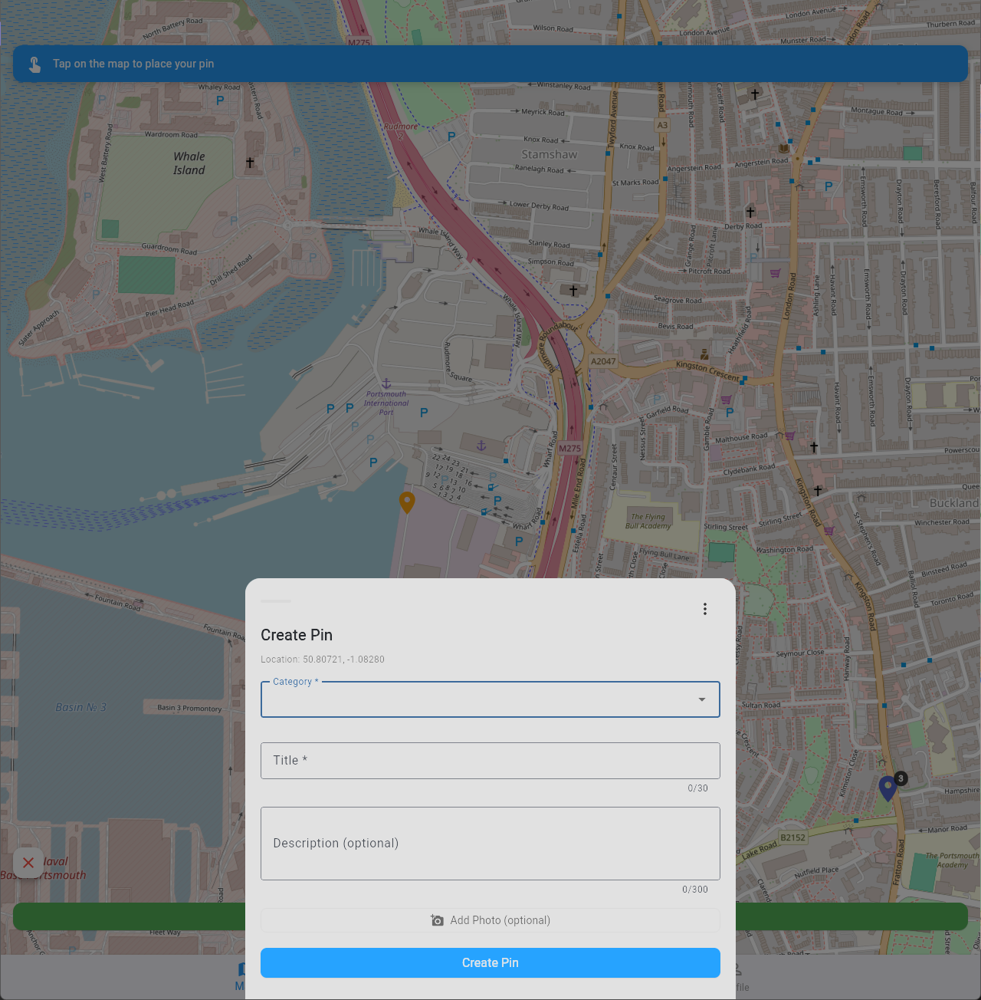
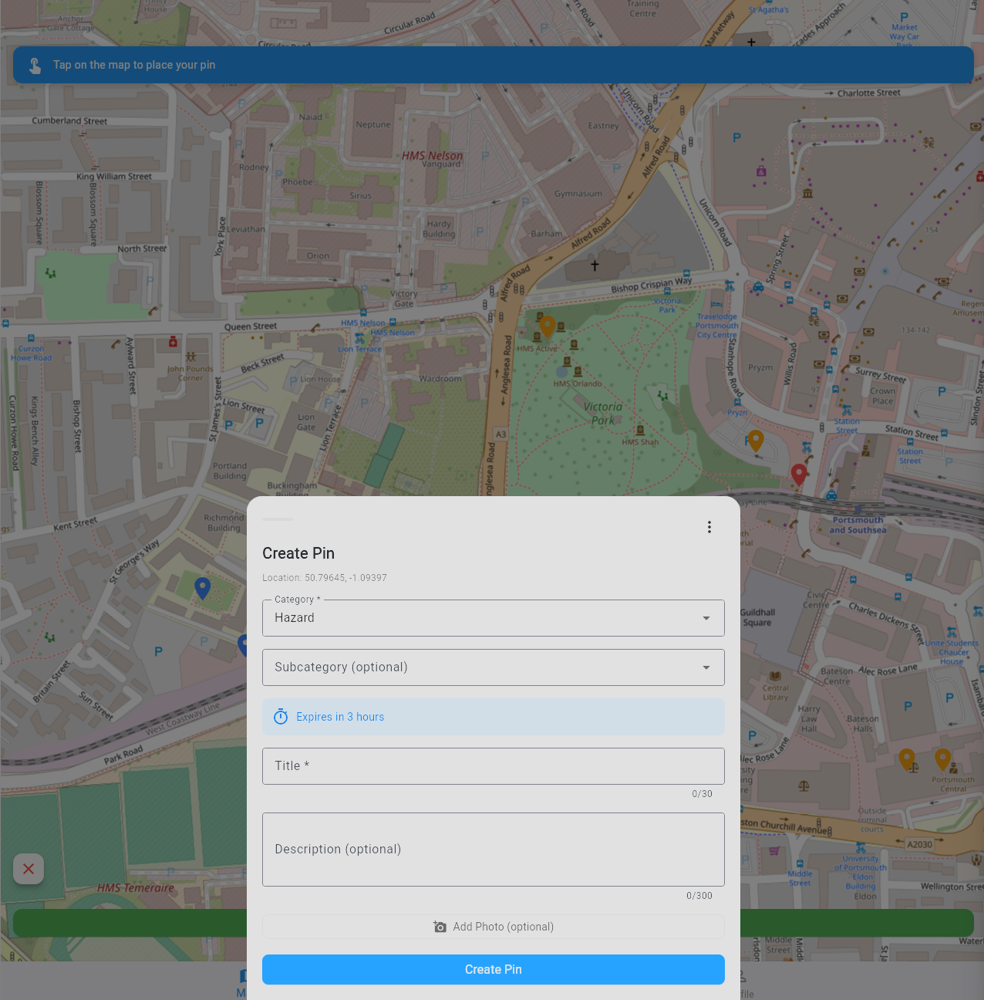
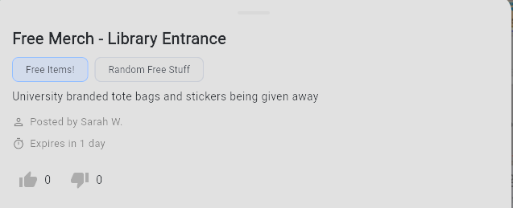
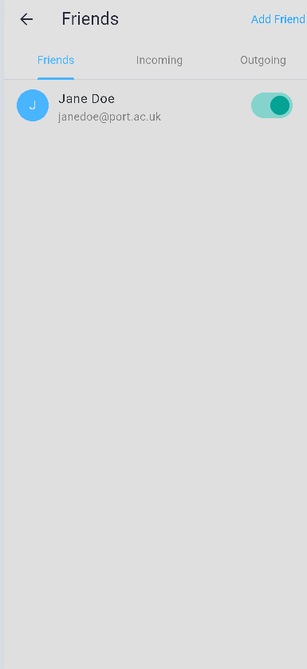
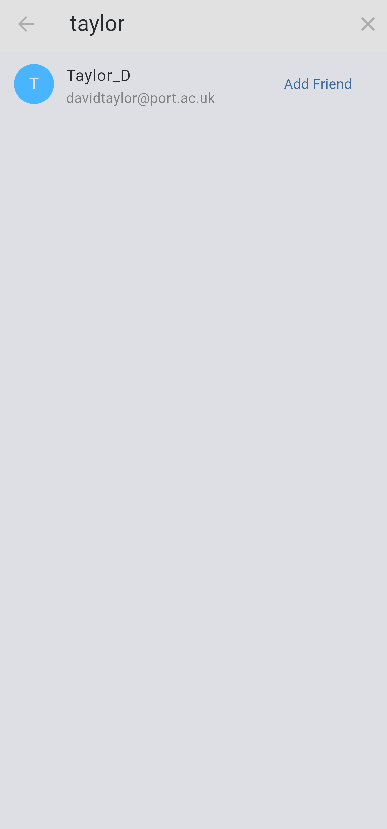

# User Manual

## What this app is for 
This is an app made for uni students to allow them to keep track of where their friends are and to place pins alerting them of dangers and information 

## Getting started 

## Main screens in this app 
There are 3 main screens in this app
### Select User Screen
This screen allows you to select a user, if this app were to exist as a real application, this would be a login screen with proper usernames, passwords and authentication
### Map Screen
This screen contains 4 buttons, one to filter pins, one to toggle whether you want to share your location with the website, one to centre your location and one to add a pin. A picture shows where each of these 4 buttons are located 
(replace the picture below later)

Further explanation of what each of these buttons do will be shown later in this user guide
## Profile Screen
This screen allows you to view your profile, see how many pins you've made, edit your name and display name and view your friend codes

Details on what each of these buttons do will be explained further on in the document 
## Creating a pin 

In order to create a pin, you need to press the button circled in the picture above. Once you do that, you will be prompted to click on where you want the pin to be placed. If you have location enabled, it will default to placing the pin at your current location however you may still move it if the incident occurred in a different location to where you are. A picture of how this looks is below 

Once you confirm the location you want the pin to be placed in, you will be shown the menu seen in the picture below

By clicking on the categories, you will get the drop down shown in the picture below

Once you click on one of these, the menu will look as it does below

From here, you can choose an optional subcategory if you want to give more information for easier identification of what the pin is about, give the pin a title which is required to create a pin and explains to a user when clicking on the pin what it is about and an optional description for if you want to go into more detail about the event that the pin correlates to

## Viewing and filtering pins 

When you click on the button shown above, you will see a menu pop up, shown below

As you can see from the 2 pictures above, you can filter the pins that are visible by category, expiry date (Maximum expiry date refers to pins that expire before or on the specified date) or also by the category level (what kind of category it is, e.g. Free Items! comes under information)
Once you have selected the filters you want, press apply filters and then all the pins that come under one or more of the filters you have selected will appear
## Pin interaction
When looking at pins on a map, there are 3 types of pins, each signified by a different colour. Red pins signify the danger category level, yellow pins signify the warning category level and light blue pins represent information. When clicking on any of these types of pins, a menu will appear from the bottom as shown below

As you can see in the picture above, there is a title, then under it is the category and subcategory of the pin, then any further description regarding what the pin is about. 
If there are multiple pins close enough to be touching on the map, then the program will aggregate them into a dark blue pin with a number signifying how many pins are present at that location. When that type of pin is clicked, a menu will appear like the one below

If you click on any of the items listed in this menu, then it will behave akin to clicking on a single pin of another type

## Friends and sending friend requests
If you navigate to the profile section of the app, you will notice that there is a button that says Friends. In this section, you can see your friends list, see your incoming and outgoing friend requests and add new friends

### Friends

In the picture above, you will see a picture of a user's friends list. In this section, you can view the friends you've made on the app and using the toggle switch to the right, toggle whether you want to share location with them or not

### Incoming

In the picture above, you can see the incoming section. In this section, you can see all of your incoming friend requests, if any. If you want to accept a friend request, press the tick button, if you want to decline a friend request, press the cross button and if you want to block the user, press the block button (the final one)

### Outgoing

In the picture above, you can see the outgoing friend requests of a user, if you want to cancel a friend request for whatever reason, you can press the cancel button and the friend request will disappear from the other user's incoming friend requests 

### Adding a friend

By tapping on the button that says Add Friend, you will open up the screen seen below

In this screen, in order to add a friend, type in at least 3 consecutive letters of the name of the user you want to add and then the search feature should come up with suggestions based on what letters you've typed in so far, an example of this is below

By then clicking Add Friend, a friend request will be sent to the given user unless you are already friends with them in which case it will say "You are already friends"

